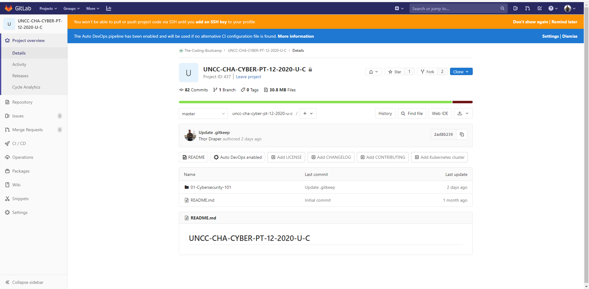
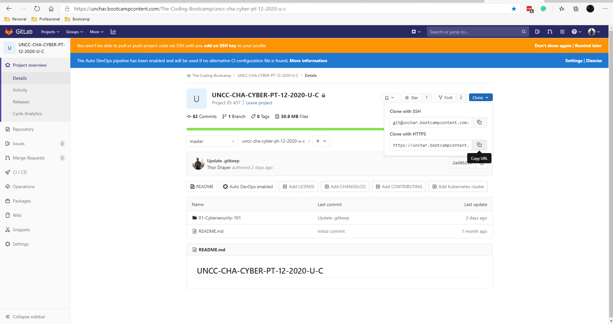
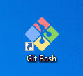
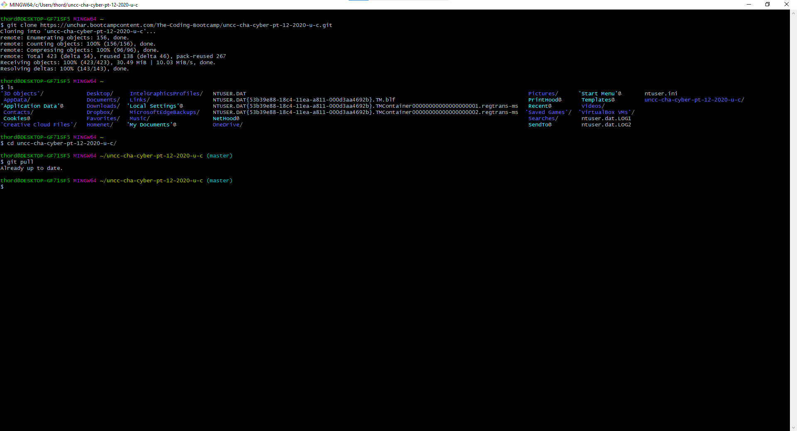

# GitBash
## What is Git?
Git is a distributed version-control system for tracking changes in any set of files, originally designed for coordinating work among programmers cooperating on source code during software development. Its goals include speed, data integrity, and support for distributed, non-linear workflows 

### Step 1
Navigate to out GitLab repository


### Step 2
Press clone and copy the HTTPS link


### Step 3
Start GitBash


### Step 4
Enter
```
git clone https://unchar.bootcampcontent.com/The-Coding-Bootcamp/uncc-cha-cyber-pt-12-2020-u-c.git
```
'Expected Outcome'
```
Cloning into 'uncc-cha-cyber-pt-12-2020-u-c'...
remote: Enumerating objects: 156, done.
remote: Counting objects: 100% (156/156), done.
remote: Compressing objects: 100% (96/96), done.
remote: Total 423 (delta 54), reused 138 (delta 46), pack-reused 267
Receiving objects: 100% (423/423), 30.49 MiB | 10.03 MiB/s, done.
Resolving deltas: 100% (143/143), done.

```
### Step 5 
Verify that the "uncc-cha-cyber-pt-12-2020-u-c" folder downloaded 
```
ls
```
### Step 6
Navigate to the directory
```
cd uncc-cha-cyber-pt-12-2020-u-c
```
### Step 7
Verify that you have the most recent version of our GitLab repository
```
git pull
```
'The expected result is' “Already up to date.”



## Common Issues
### Mac's
'Install developer tools'

Try this [link](https://mac-how-to.gadgethacks.com/how-to/install-command-line-developer-tools-without-xcode-0168115/#:~:text=%20Install%20the%20Command%20Line%20Developer%20Tools%20Without,the%20Waiting%20Game.%20Now%2C%20you%20just...%20More%20)