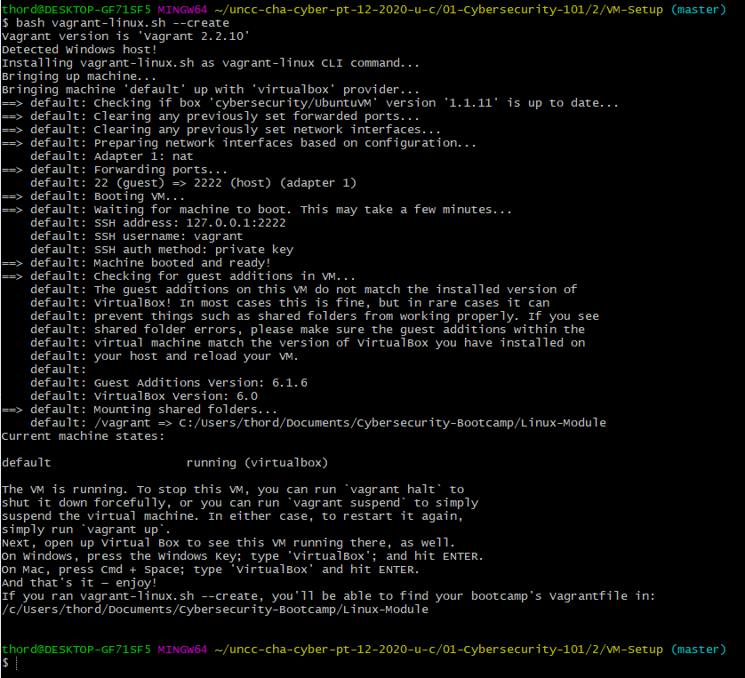

# Objective

## What is Vagrant
Vagrant is an open-source software product for building and maintaining portable virtual software development environments; e.g., for VirtualBox, KVM, Hyper-V, Docker containers, VMware, and AWS. It tries to simplify the software configuration management of virtualizations in order to increase development productivity. 
## Terms
* sudo: super user do
* bash: this is a shell for executing scripts

### Step 1
Verify you're in the right directory
```
ls
```

### Step 2


'Windows'
```
bash vagrant-linux.sh --create
```

'Mac'
```
sudo bash vagrant-linux.sh --create
```



Common issues:
Virutalizaion not turned on in the BIOS
Read this [documentation](https://helpdeskgeek.com/how-to/enable-virtualization-in-the-bios/)


No such directory